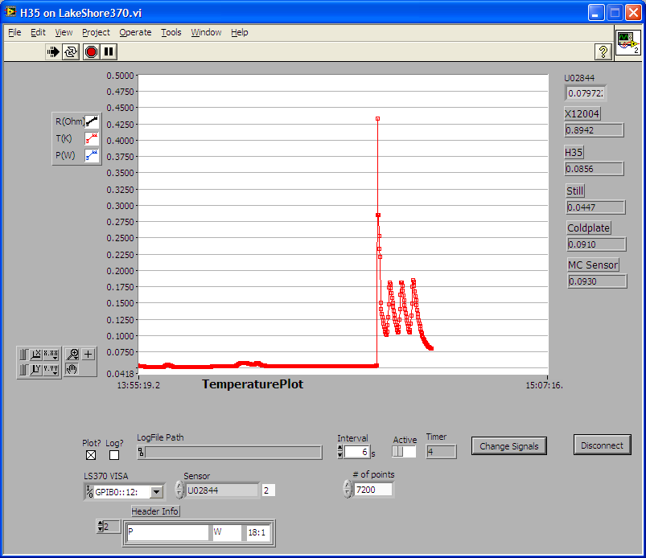

Want to try a multi-DCRC test of flashing
========================================

`time 09:40`

Yesterday, had a successful test using the script `flashandflash.py` to create a MIDAS sequencer
script and then run through the MIDAS web interface.  In principle, this can be done for any
number of DCRCs so I should test it with 3 DCRCs today.

People in the lab are doing some PSD measurements, so I should wait until after lunch.

`time 14:00`

Turns out one of the DIBs on G110, which is the detector that's being run, does not have any LEDs
(they are open).  So we'll try it with just two DCRCs.  I've requested that we make it so that the
detectors have the timing link set up.  I'll go down and see if I can get some notes about that. 

`time 14:20`

Turned on the MIDAS DAQ with boards DCRC50 and DCRC33 plugged into DIB2 (stripline 27) and DIB1
(stripline 19) respectively.

This seemed to work and here are the temperature readings from this measurement.

Setting up the timing link
==========================

`time 14:14`

Making the DCRC50 the slave and DCRC33 the master.  This is accomplished in the telnet sessions
by: `wr 15 0` on all of them, then `wr 15 20` to set up "initial" timing, then `wr 30 0900` (turn
on board and apply FET heater) then immediately `wr 30 0800` (turn off the FET), then `wr 3c 0`
(turn off the test signal). 

Then only on the slave(s) do `wr 15  10`, then on the master do `wr 15 1` then immediately `wr 15
21`.

Setting up sequencer script at Berkeley
======================================

`time 17:10`

We copied over the `flashandflash.py` script to Berkeley and wanted to try it out on their run.
First I copied the `.py` file to `cedar.berekeley.edu`.  After running we placed the `.msl` file
in the directory `/data/MidasDAQ/online/sequencer/`.  Further, we had to change the `Path`
variable in the `/Sequencer/State/` ODB directory to point to the correct linux OS directory.  

After then loading the `.msl` file as normal in the sequencer the Berkeley guys got a red
highlight on the `ODBGET` command saying it does not exist. Amy remembered that this feature was
added to the sequencer specifically for us sometime before September 27 2014.  It turned out that
Berkeley was using an older version of MIDAS for some reason, they are looking into that before we
try the test again. 
