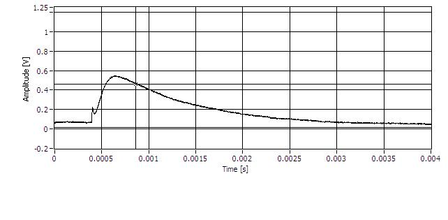
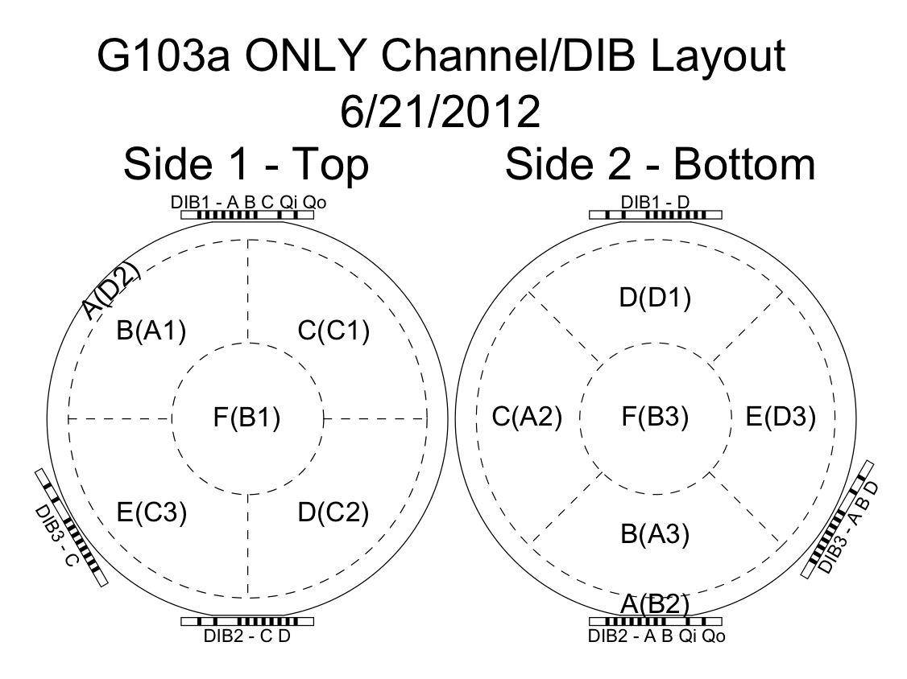
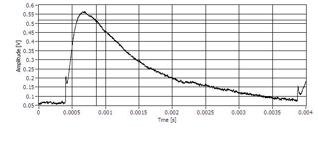
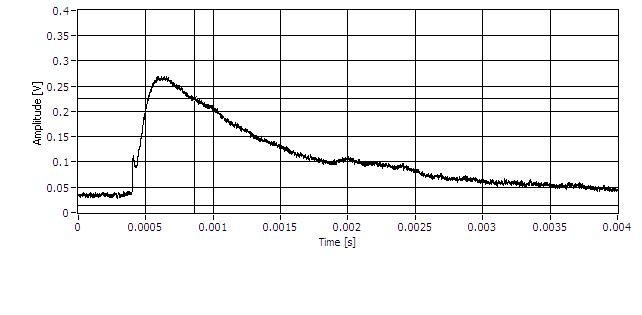

Run 53 G106a DCRC comparisons
=============================

Yesterday we were having a look at some of the pulses that came out of the 3-dib setup for the UMN
K100 Run 53 data run with G106a.  We'll continue on some of this today.  We started with DCRC 50
(`131.225.52.181`) on DIB 3 and I noticed some "bad" phonon pulses.  Or at least some that looked
consistent with the bad ones from [Allisons note UMN-MISC-166](http://www.hep.umn.edu/cdms/cdms_restricted/K100/analysis/PulseAnalysis_140521/).

After noticing this we switched over to DCRC 31 (`131.225.52.116`) on DIB 3 to try to see if the
problem followed the DCRC or the QET channels. 

Firstly, on many channels we noticed a pre-pulse spike that I've never seen before.  It is a
curious feature and I'm not sure what can cause something like that.  It seems like it can't be
phonon physics:

The above is from Channel B on DIB 3.  I'll get the mapping diagram for this detector, here it is:

It seems like Channel B on DIB 3 corresponds to S2F on the detector, one of the inner channels.

Beyond that we started taking pulse examples from each channel, increasing the "frontend gain" and
the "output gain" as high as possible.  Generally speaking, I *think* the first is the gain
applied before feedback -- so increasing it should tend to stabalize the signal (but not make it
much larger).  The output gain I think is just a straight amplifier gain between what comes out of
the first-stage amplification and what gets recorded.  I should perhaps get a copy of the phonon
circuit in these notes after I record the pulses. 

We tried to get all the pulses of reasonably similar size and shape with the frontend gain at 5
and the output gain at 4 (remember the output gain has a strange scale, I think it goes up by
factors of two or something and is different on RevC and RevC.1). 

Phonon channel A, frontend gain 5, output gain 4, driver offset -0.048, threshold 250 ADC bins:

Phonon channel B, frontend gain 5, output gain 4, driver offset -0.008, threshold 50 ADC bins:

