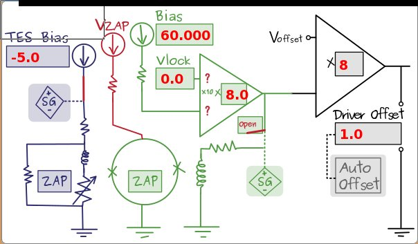

Run 53 DCRC 50 data in DIB 3
============================

For a formal comparison to the data we took a couple days ago, we switched to DCRC 50
(`131.225.52.181`) on DIB 3 to have a comparison between RevC.1 (DCRC 50) and RevC (DCRC 31).
Overall it looks like the DCRC 50 is worse, indicating maybe a problem with the RevC.1 in general.
It is hard to tell with just single pulses though, so we took 10 minutes of data in this
configuration too. 

Phonon channel A, frontend gain 5, output gain 3, driver offset 0.028, threshold 250 ADC bins:

Phonon channel B, frontend gain 5, output gain 3, driver offset 0.042, threshold 250 ADC bins:

Phonon channel C, frontend gain 5, output gain 3, driver offset 0.018, threshold 150 ADC bins:

Phonon channel D, frontend gain 5, output gain 3, driver offset 0.066, threshold 250 ADC bins:

There are some other things that came up too:

* saturated pulses
* improvements when other channels grounded (tentative)
* grounding braid tries (not much success here)

For the saturated pulses we looked at things for various output gains with a fixed frontend gain
of 5.  The saturation level (in volts on the labView pulse display) changed considerably with this
output gain.  I don't understand this. 

Run 53 comparing DCRCs in DIB 3
===============================

DCRC 31 | DCRC50
:-----------------------------:|:------------------:
|
Considering yesterday's data
============================

I should probably first get a picture of the phonon channels. One diagram exists in [Amy's DCRC UI](http://dcrc01.triumf.ca:8081/CS/aroberts/dcrc_ui/dcrc.html).  
There the output gain (sometimes called PGA gain) is shown to be *after* the frontend gain
(sometimes called the VGA gain).  Maybe this is significant for the saturation effects that we're
seeing above. 

