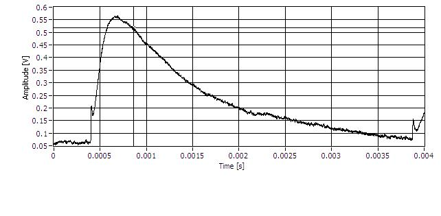

Run 53 DCRC 50 data in DIB 3
============================

For a formal comparison to the data we took a couple days ago, we switched to DCRC 50
(`131.225.52.181`) on DIB 3 to have a comparison between RevC.1 (DCRC 50) and RevC (DCRC 31).
Overall it looks like the DCRC 50 is worse, indicating maybe a problem with the RevC.1 in general.
It is hard to tell with just single pulses though, so we took 10 minutes of data in this
configuration too. 

Phonon channel A, frontend gain 5, output gain 3, driver offset 0.028, threshold 250 ADC bins:

DCRC 31 | DCRC50
:-----------------------------:|:------------------:
|

Phonon channel B, frontend gain 5, output gain 3, driver offset 0.042, threshold 250 ADC bins:

Phonon channel C, frontend gain 5, output gain 3, driver offset 0.018, threshold 150 ADC bins:

Phonon channel D, frontend gain 5, output gain 3, driver offset 0.066, threshold 250 ADC bins:

