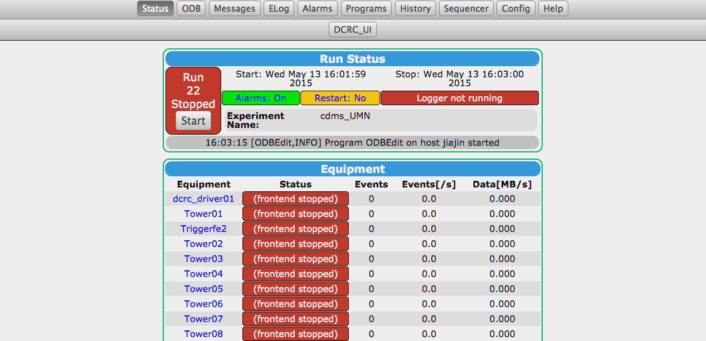
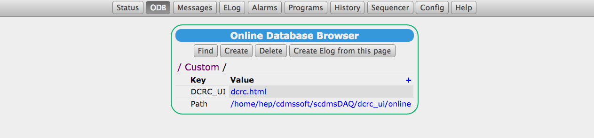

Instructions for getting the auxiliary pages working with MIDAS
===============================================================

For example, Amy's DAQ UI.  There are some instructions
[here](https://midas.psi.ch/htmldoc/RC_mhttpd_Activate.html#RC_odb_custom_tree).  This is
basically the procedure for setting a new MIDAS variable etc.  I've done this in my MIDAS setup
script in the `cdmssoft` directory where MIDAS is run. 

We ended up having to set up a special MIDAS ODB "Custom" directory.  Within the Custom directory,
there are a number of variables that are defined.  The "Path" variable is necessary -- it supplies
a path where html content is searched for.  The rest are content files like "html" files.  Their
variable names are used to make a button on the front page of MIDAS that serves that content. We
called our front page `DCRC_UI` and it looks thusly:

You can also see how the variables are setup under "Custom."

