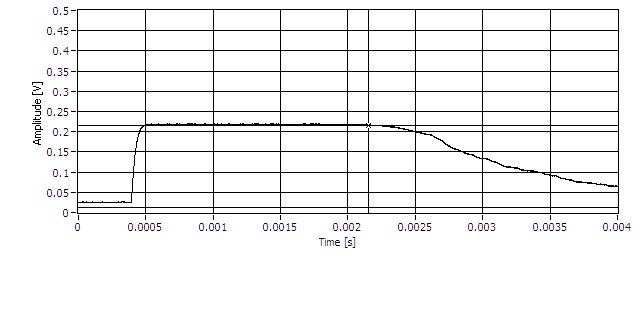
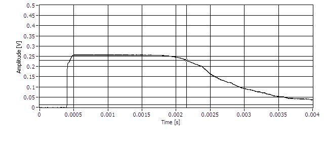
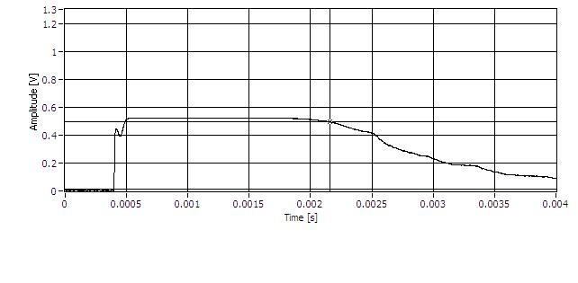
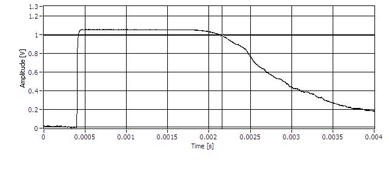
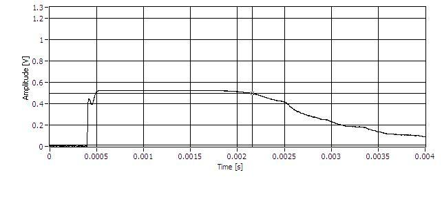

Run 53 DCRC 50 data in DIB 3
============================

This is a continuation from notes in `log_150611.md`. In the same subheading.

In addition to the pulses we saw from DCRC 50 to compare the by-eye quality, we took some pulses
that looked saturated.  The saturation happened at different places for different values of the
output gain.  I don't understand this currently, perhaps looking back at the diagram on the notes
from `log_150611.md` will help later. 

Channel A using Output Gain 1, and Frontend Gain 1.0:

Channel A using Output Gain 1, and Frontend Gain 5.0:

Channel A using Output Gain 2, and Frontend Gain 5.0:

Channel A using Output Gain 3, and Frontend Gain 5.0:

Channel A using Output Gain 4, and Frontend Gain 5.0:

We should note that on DCRC RevC.1 the output gain is specified by a 2-bit value, so anything
beyond an output gain of 3 doesn't really make sense.  The labView VI apparently just tries to
write a larger-than-two-bit value (the DCRC RevC has this amplification setting as a 3-bit value)
and ends up with the last two bits of that value, so the pattern repeats every 3 gain increments. 

As with the DCRC 31 in dib 3, we've also taken short data sets for DCRC 50 and DCRC X.  

The data series that we took for this is on the computer `Vuk-01.spa.umn.edu` in the directory
`/cygdrive/i/data/run053/20150610/` and the series number is `07150610_1315`.

For DCRC X the data is in `/cygdrive/i/data/run053/20150611/` and the series number is `07150611_1108`.

More information about these runs is in the K100 run diary from
[06/09/15](https://zzz.physics.umn.edu/cdms/doku.php?id=cdms:k100:run_diary:20150609),
[06/10/15](https://zzz.physics.umn.edu/cdms/doku.php?id=cdms:k100:run_diary:20150610), and
[06/11/15](https://zzz.physics.umn.edu/cdms/doku.php?id=cdms:k100:run_diary:20150611)
