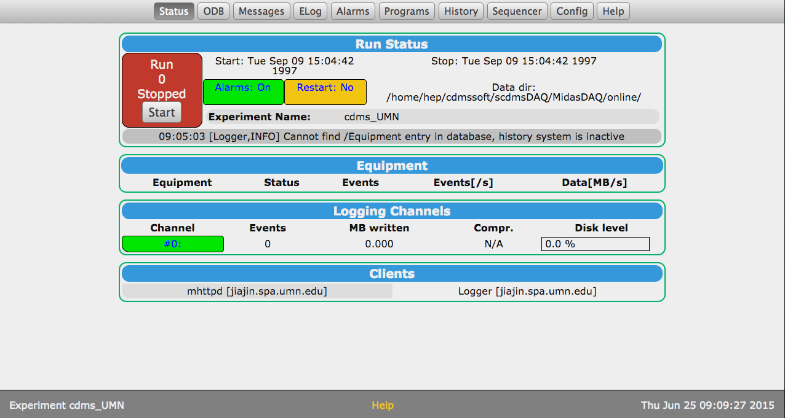
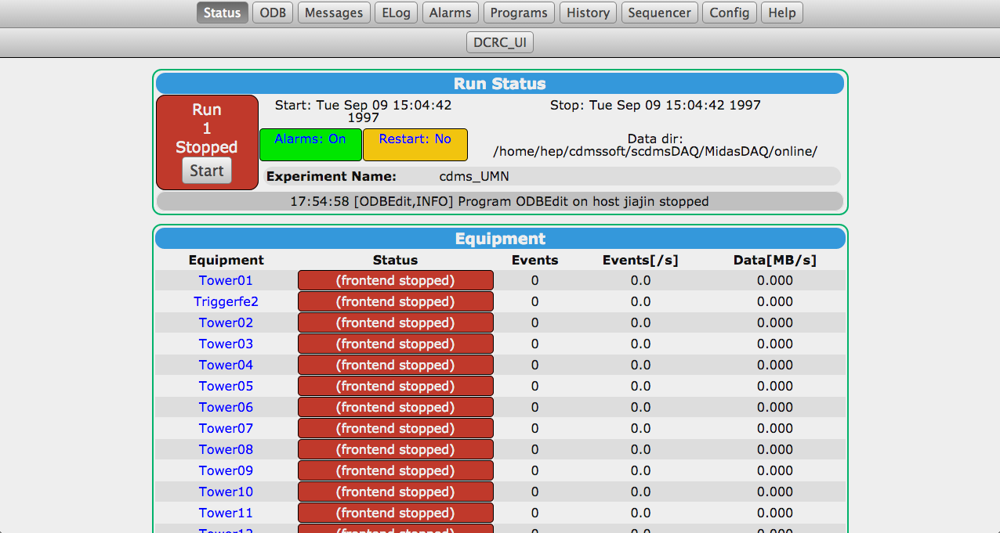

Setting up Midas again
======================

get code
--------

We pulled the git version of MidasDAQ using the following clone.

```
$ssh jiajin.spa.umn.edu
$sudo -u cdmssoft -s
$cd ~
$cd repositories/
$git clone villaa@nero.stanford.edu:/data/git/DAQ/MidasDAQ MidasDAQ
```

This goes into the top-level repositories directory where we can put all the code repository
versions and then sim-link to them at the lower levels.  For example I then did:

```
$cd ../scdmsDAQ/
$rm MidasDAQ
$ln -s ln -s /home/hep/cdmssoft/repositories/MidasDAQ
```

compile code
-----------

We then had to go into the `MidasDAQ/src` directories and make the binaries like:

```
$cd MidasDAQ/src
$make dcrc_driver.exe
$make towerfe3.exe
$make triggerfe2.exe
```

Note that the "all" tag does not make the appropriate binaries, and that the makesystem for this
code should be fixed to be a lot better. 

set the exptab
--------------

For our system at UMN the exptab needs to be changed so that it has the appropriate user and
experiment name.  It consists of the single line:

```
cdms_UMN /home/hep/cdmssoft/scdmsDAQ/MidasDAQ/online cdmssoft
```

move the startup scripts
------------------------

So there was a startup script that is included in the repository that assumes we are running an
experiment name called `cdms_test` and that our hostname begins with `dcrc01`.  Neither of these
things are true at UMN (I guess we can change them to be) so we needed a new startup script.  This
goes in the `MidasDAQ/online/bin` directory.  It is called `start_daq_local.sh`.

```
!/bin/sh

cd /home/hep/cdmssoft/scdmsDAQ/MidasDAQ/online

case `hostname` in
jiajin*)
    echo "Good, we are on jiajin!"
    ;;
*)
    echo "The start_daq script should be executed on jiajin"
    exit 1
    ;;
esac

odbedit -c clean

mhttpd  -p 8081 -D -e cdms_UMN
mserver -p 7071 -D
mlogger -D -e cdms_UMN

end file
```

With the current setup in response to this script we got:

```
Good, we are on jiajin!
[ODBEdit,ERROR] [system.c:1021:ss_shm_delete,ERROR] shm_unlink(/cdms_UMN_SYSMSG_SHM) errno 2 (No such file or directory)
[ODBEdit,ERROR] [system.c:1021:ss_shm_delete,ERROR] shm_unlink(/cdms_UMN_SYSTEM_SHM) errno 2 (No such file or directory)
Becoming a daemon...
mserver started interactively
Becoming a daemon...
Becoming a daemon...
```

Basically, it worked, I've seen those errors before or something like them.  I'm not totally sure
what it means, but it's clear that the ODB is not initialized totally.  We have to find out how to
populate the ODB. 

So this is what the MIDAS front-end looked like without an ODB:



Need to kill stuff:

```
jiajin:bin cdmssoft$ps -u cdmssoft
PID TTY          TIME CMD
25608 pts/0    00:00:00 bash
28584 pts/1    00:00:00 bash
29350 ?        00:00:00 mhttpd
29352 ?        00:00:00 mserver
29355 ?        00:00:00 mlogger
29577 pts/0    00:00:00 ps
jiajin:bin cdmssoft$kill -9 29350
jiajin:bin cdmssoft$kill -9 29355
jiajin:bin cdmssoft$kill -9 29352
```

Setup the new ODB (annoying! and poorly documented)
--------------------------------------------------

So we are following the file `documentation/triumf_dcrc_installation.txt` in the MidasDAQ repo.
It's a little unclear, but after the making of executables that we did above, and changing of
exptab, we need to recreate the ODB. 

First we need to remove the .ODB.SHM that we just created by (incorrectly) running Midas.  This
will be in the Midas experimental directory as set by `exptab` (I guess).  Then set up a new blank
ODB with the right size:

```
odbedit -s 4194304
```

Got this error, and the instructions say that it's "normal:"

```
[ODBEdit,ERROR] [system.c:1021:ss_shm_delete,ERROR] shm_unlink(/cdms_UMN_ODB_SHM) errno 2 (No such file or directory)
```

Then add a couple of new keys to the ODB:

```
jiajin:online cdmssoft$odbedit
[local:cdms_UMN:S]/>create DWORD /Experiment/MAX_EVENT_SIZE
[local:cdms_UMN:S]/>set /Experiment/MAX_EVENT_SIZE 25600000
[local:cdms_UMN:S]/>create DWORD "/Experiment/Buffer sizes/SYSTEM"
[local:cdms_UMN:S]/>set "/Experiment/Buffer sizes/SYSTEM" 256000000
[local:cdms_UMN:S]/>exit
jiajin:online cdmssoft$odbedit
[local:cdms_UMN:S]/>ls
System                          
Programs                        
Experiment                      
Logger                          
Runinfo                         
Alarms                          
[local:cdms_UMN:S]/>ls Experiment/
Name                            cdms_UMN
Buffer sizes                    
MAX_EVENT_SIZE                  25600000
[local:cdms_UMN:S]/>              
[local:cdms_UMN:S]/>ls "Experiment/Buffer sizes/
SYSMSG                          100000
SYSTEM                          256000000
[local:cdms_UMN:S]/>exit
```

Note the command `odbedit -c clean` doesn't work for us, it seems to just return, when the desired
behavior is to be dropped into an odb edit session, as above.

Then the instructions say to run `towerfe.exe -i 1` in the `src/` directory (one of the
executables we just made).  We modified this to be interpreted as `towerfe3.exe -i 1` because the
instructions are old, and we think this is the new version of that.

This resulted in some "errors" but the instructions say that that is normal and it's in fact good
because that means we are creating the parameters that are necessary.

Setting up ODB more
-------------------

So, there are more setups we have to do to the ODB and we tried to do this with the following
script:

```
#!/bin/sh

#script to set up specifics of ODB after dcrc_server.exe, towerfe3.exe, triggerfe2.exe
#initialization. 

EXP_NAME=cdms_UMN
MIDAS_DIR=/home/hep/cdmssoft/scdmsDAQ/MidasDAQ/online

odbedit -e ${EXP_NAME} -c 'create STRING "/Logger/History dir"[256]'
odbedit -e ${EXP_NAME} -c 'set "/Logger/History dir"
"/home/hep/cdmssoft/scdmsDAQ/MidasDAQ/online/history/"'
odbedit -e ${EXP_NAME} -c 'create STRING "/Logger/Elog dir"[256]'
odbedit -e ${EXP_NAME} -c 'set "/Logger/Elog dir"
"/home/hep/cdmssoft/scdmsDAQ/MidasDAQ/online/elog/"'
odbedit -e ${EXP_NAME} -c 'set "/Logger/ODB Dump" y'

#create some programs
odbedit -e ${EXP_NAME} -c 'create STRING "/Programs/dcrc_driver01/Start command"[256]'
odbedit -e ${EXP_NAME} -c 'create BOOL "/Programs/dcrc_driver01/Required" y'
odbedit -e ${EXP_NAME} -c 'set "/Programs/dcrc_driver01/Start command"
"'${MIDAS_DIR}'/src/dcrc_driver.exe -i 1 -D"'
odbedit -e ${EXP_NAME} -c 'set "/Programs/dcrc_driver01/Required" y'

odbedit -e ${EXP_NAME} -c 'create STRING "/Programs/towerfe3_01/Start command"[256]'
odbedit -e ${EXP_NAME} -c 'create BOOL "/Programs/towerfe3_01/Required" y'
odbedit -e ${EXP_NAME} -c 'set "/Programs/towerfe3_01/Start command"
"'${MIDAS_DIR}'/src/towerfe3.exe -i 1 -D"'
odbedit -e ${EXP_NAME} -c 'set "/Programs/towerfe3_01/Required" y'

odbedit -e ${EXP_NAME} -c 'create STRING "/Programs/triggerfe2/Start command"[256]'
odbedit -e ${EXP_NAME} -c 'create BOOL "/Programs/triggerfe2/Required" y'
odbedit -e ${EXP_NAME} -c 'set "/Programs/triggerfe2/Start command"
"'${MIDAS_DIR}'/src/triggerfe2.exe -D"'
odbedit -e ${EXP_NAME} -c 'set "/Programs/triggerfe2/Required" y'

#a dummy variable for flash sequencing
odbedit -e ${EXP_NAME} -c 'create STRING "/Playground/Run sequence"[256]'
odbedit -e ${EXP_NAME} -c 'set "/Playground/Run sequence" no_flash'
#odbedit -e ${EXP_NAME} -c 'del "/Playground/Run sequence"'
```

This failed and resulted in a lot of errors like:

```
[ODBEdit,ERROR] [odb.c:8451:db_get_record,ERROR] struct size mismatch for "/Programs/dcrc_driver01" (expected size: 316, size in ODB: 32)
[ODBEdit,ERROR] [alarm.c:679:al_check,ERROR] Cannot get program info record
[ODBEdit,ERROR] [odb.c:8451:db_get_record,ERROR] struct size mismatch for "/Programs/dcrc_driver01" (expected size: 316, size in ODB: 36)
[ODBEdit,ERROR] [alarm.c:679:al_check,ERROR] Cannot get program info record
[ODBEdit,ERROR] [odb.c:8451:db_get_record,ERROR] struct size mismatch for "/Programs/dcrc_driver01" (expected size: 316, size in ODB: 76)
[ODBEdit,ERROR] [alarm.c:679:al_check,ERROR] Cannot get program info record
[ODBEdit,ERROR] [odb.c:8451:db_get_record,ERROR] struct size mismatch for "/Programs/dcrc_driver01" (expected size: 316, size in ODB: 76)
[ODBEdit,ERROR] [alarm.c:679:al_check,ERROR] Cannot get program info record
[ODBEdit,ERROR] [odb.c:8451:db_get_record,ERROR] struct size mismatch for "/Programs/towerfe3_01" (expected size: 316, size in ODB: 92)
```

And it resulted in errors like this appearing every time the ODB editor is opened. 

Also when running `towerfe3.exe -i 1` we get errors like below. 

```
[towerfe3_01,ERROR] [odb.c:9431:db_open_record,ERROR] struct size mismatch for "/Equipment/Tower01/Settings/DCRC1/General" (expected size: 168, size in ODB: 16)
[towerfe3_01,ERROR] [odb.c:9431:db_open_record,ERROR] struct size mismatch for "/Equipment/Tower01/Settings/DCRC2/General" (expected size: 168, size in ODB: 16)
[towerfe3_01,ERROR] [odb.c:9431:db_open_record,ERROR] struct size mismatch for "/Equipment/Tower01/Settings/DCRC3/General" (expected size: 168, size in ODB: 16)
[towerfe3_01,ERROR] [odb.c:9431:db_open_record,ERROR] struct size mismatch for "/Equipment/Tower01/Settings/DCRC4/General" (expected size: 168, size in ODB: 16)
[towerfe3_01,ERROR] [odb.c:9431:db_open_record,ERROR] struct size mismatch for "/Equipment/Tower01/Settings/DCRC5/General" (expected size: 168, size in ODB: 16)
[towerfe3_01,ERROR] [odb.c:9431:db_open_record,ERROR] struct size mismatch for "/Equipment/Tower01/Settings/DCRC6/General" (expected size: 168, size in ODB: 16)
```

So in desparation, not knowing what to do really we went to the `online/src` directory and ran all
of the programs we compiled.  This seemed to "make" a lot of ODB variables, and apparently in a
better way than we had.  We now have many of the directories of the variables we were trying to
make with the simple shell script above.  The shell script is now stored in
`MidasDAQ/setup/umn/setODB.sh`.  The program invocations always did some ODB setup and then
started their running.  The invocation of `dcrc_driver.exe -i 1` seemed to take the longest but is
setting the most ODB settings -- all the DCRC settings.   These programs were then quit with the
inelegant Ctrl-C, and they usually required me to do Ctrl-C twice.

So running the programs all like this and then running my `setODB.sh` script modified to **not**
create directories but just do the following seemed to work:

```
#!/bin/sh

#script to set up specifics of ODB after dcrc_server.exe, towerfe3.exe, triggerfe2.exe
#initialization. 

EXP_NAME=cdms_UMN
MIDAS_DIR=/home/hep/cdmssoft/scdmsDAQ/MidasDAQ/online

odbedit -e ${EXP_NAME} -c 'create STRING "/Logger/History dir"[256]'
odbedit -e ${EXP_NAME} -c 'set "/Logger/History dir" "/home/hep/cdmssoft/scdmsDAQ/MidasDAQ/online/history/"'
odbedit -e ${EXP_NAME} -c 'create STRING "/Logger/Elog dir"[256]'
odbedit -e ${EXP_NAME} -c 'set "/Logger/Elog dir" "/home/hep/cdmssoft/scdmsDAQ/MidasDAQ/online/elog/"'
odbedit -e ${EXP_NAME} -c 'set "/Logger/ODB Dump" y'

#create some programs
#odbedit -e ${EXP_NAME} -c 'create STRING "/Programs/dcrc_driver01/Start command"[256]'
#odbedit -e ${EXP_NAME} -c 'create BOOL "/Programs/dcrc_driver01/Required" y'
odbedit -e ${EXP_NAME} -c 'set "/Programs/dcrc_driver01/Start command" "'${MIDAS_DIR}'/src/dcrc_driver.exe -i 1 -D"'
odbedit -e ${EXP_NAME} -c 'set "/Programs/dcrc_driver01/Required" y'

#odbedit -e ${EXP_NAME} -c 'create STRING "/Programs/towerfe3_01/Start command"[256]'
#odbedit -e ${EXP_NAME} -c 'create BOOL "/Programs/towerfe3_01/Required" y'
odbedit -e ${EXP_NAME} -c 'set "/Programs/towerfe3_01/Start command" "'${MIDAS_DIR}'/src/towerfe3.exe -i 1 -D"'
odbedit -e ${EXP_NAME} -c 'set "/Programs/towerfe3_01/Required" y'

#odbedit -e ${EXP_NAME} -c 'mkdir "/Programs/triggerfe2"'
#odbedit -e ${EXP_NAME} -c 'create STRING "/Programs/triggerfe2/Start command"[256]'
#odbedit -e ${EXP_NAME} -c 'create BOOL "/Programs/triggerfe2/Required"'
odbedit -e ${EXP_NAME} -c 'set "/Programs/triggerfe201/Start command" "'${MIDAS_DIR}'/src/triggerfe2.exe -D"'
odbedit -e ${EXP_NAME} -c 'set "/Programs/triggerfe201/Required" y'

#a dummy variable for flash sequencing
odbedit -e ${EXP_NAME} -c 'create STRING "/Playground/Run sequence"[256]'
odbedit -e ${EXP_NAME} -c 'set "/Playground/Run sequence" no_flash'
#odbedit -e ${EXP_NAME} -c 'del "/Playground/Run sequence"'
```


Linking the DCRC UI
-------------------

Need to create a "Custom" directory in the odb tree. Then need a "Path" and another variable which
is the name of the "button" you want.  In this case we named our button DCRC_UI.  This will
connect our button to the html file that's inserted in that variable.  We set the "Path" to
`/home/hep/cdmssoft/scdmsDAQ/dcrc_ui/online/` and the  "DCRC_UI" to `dcrc.html`.

```
[local:cdms_UMN:S]/>mkdir Custom     
[local:cdms_UMN:S]/>create STRING Custom/Path
String length [32]: 256
[local:cdms_UMN:S]/>ls Custom/
Path                            
[local:cdms_UMN:S]/>exit      
jiajin:dcrc_ui cdmssoft$pwd
/home/hep/cdmssoft/scdmsDAQ/dcrc_ui
jiajin:dcrc_ui cdmssoft$odbedit
[local:cdms_UMN:S]/>create STRING Custom/DCRC_UI
String length [32]: 
[local:cdms_UMN:S]/>exit
```

In the end our setup looked like this:



Resetting the DCRC parameters
-----------------------------

Let's take stock of our DCRCs and what parameters they have.  Specifically what we have set up for
this run.  It'd be nice for the MIDAS DCRC number to match up with the DIB number, but I think
that we can't do that, so let's just program the following.  The DIB labels are as they are as of
today's running.

|ID #   |MIDAS #   |IP   |Rev   |Enabled   | DIB |
|---|---|---|---|---|
|DCRC 31   |1   |`131.225.52.116`   |C   |n   |  - |
|DCRC 33   |2   |`131.225.53.84`   |C   |y   | 2 |
|DCRC 50   |3   |`131.225.52.181`   |C.1   |y   | 3 |
|DCRC 55   |4   |`131.225.52.85`   |C.1   |y   | 1 |
|DCRC X   |5   |`131.225.52.85`   |C.1   |n   | - |
