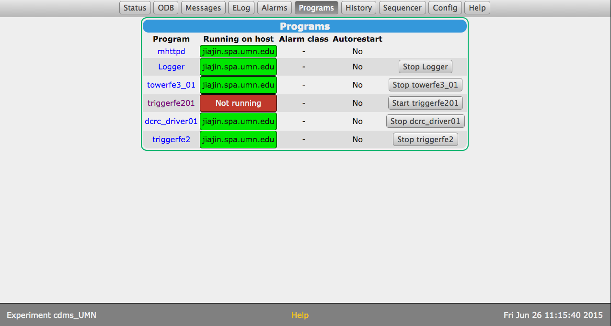
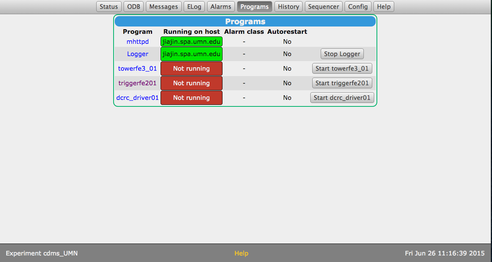
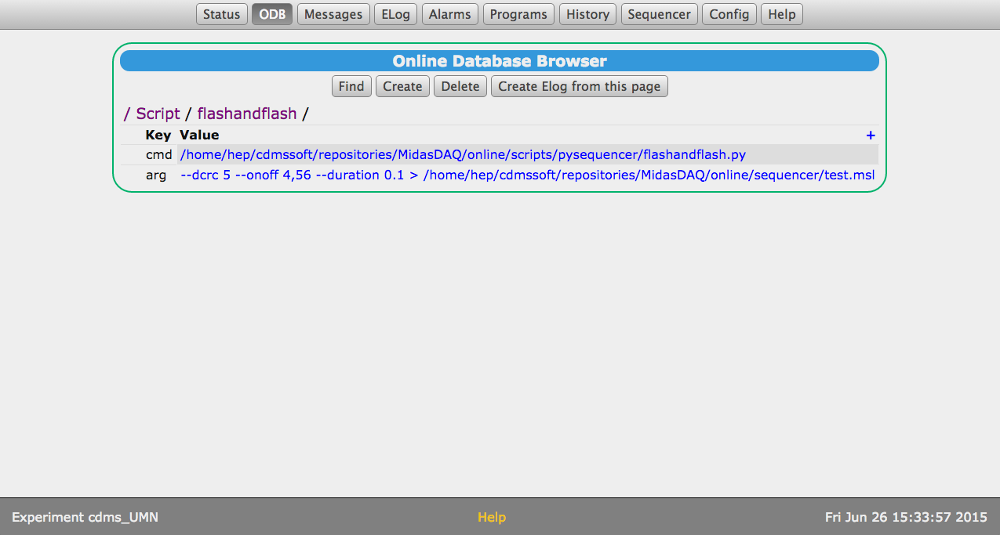
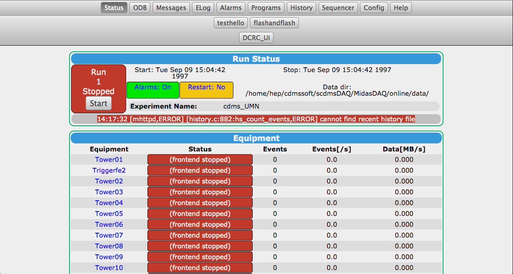

Continued setup of Midas
========================

So today we tried running the Midas we set up yesterday.  It ran ok, but there is one strangeness.
When I ran the trigger program the variable created was `Programs/triggerfe201`, so I figured that
this was what it changed to for some reason and changed my `setupODB.sh` script to be consistent
and give the correct path/executable.  When we start this program through the midas front-end it
doesn't go to green as normal -- rather it creates *another* variable `Programs/triggerfe2` and
puts that one to green. 

Also, for some reason on the front page it puts the program `dcrc_driver01` way down near the
bottom and has a bunch of towers listed that we don't have.  

We changed the `Logger/Data dir` variable to point to `data/` inside the MIDAS `online/`
directory but is a symlink to `/data/chocula/villaa/midasdata/`.

Amy Got Midas to Run a Script
=============================

If you make objects in the `Script/` directory in the ODB, MIDAS will display these as buttons on
the front page.  Furthermore each directory in this directory specifies a script that can be run.
The `cmd` parameter specifies the full path to the executable and the `arg` parameters are filled
in to the command in a space-separated way.  For example this is one that was made for my
`flashandflash.py` script:

Then, a button appears on the front page as seen below:

