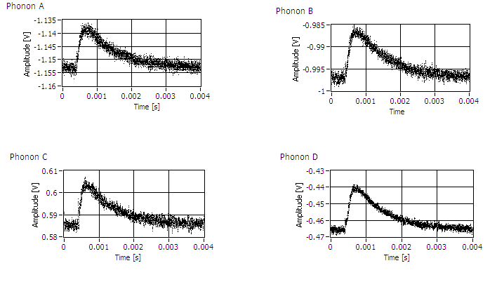
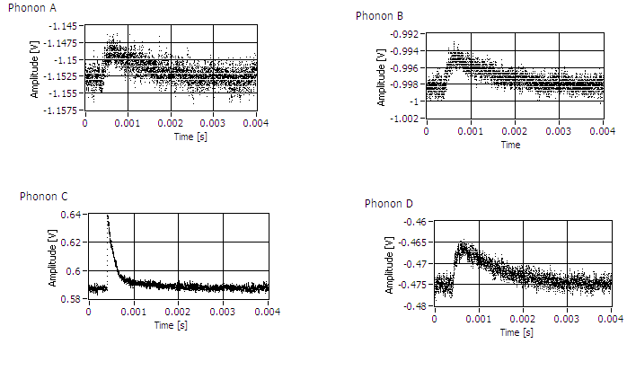
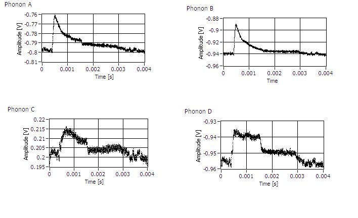
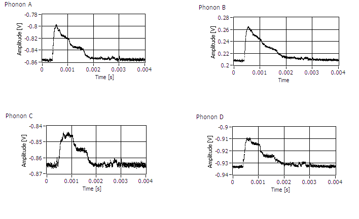

Noise progress R53
==================

So, we've come to somewhat of a crossroads on the R53 efforts.  We've got some use out of it, but
the phonon channels are plagued with a lot of noise.   We did learn about the charge threshold and
have successfully seen activation peaks.  This will be important for future analysis.   This past
Thursday, some purchase was made regarding the charge noise.  After Matt and I looked at some DIBs
by themselves, a pattern emerged where DIB 2 (read by DCRC 33, with a 100 MHz filter) seemed to
have clean pulses.

While other DIBs (unfiltered) seemed to have very bad pulses and baseline noise.  For example DIB
1, DCRC 55 and DIB 3 DCRC 50:

This lead to the suspicion that the DCRC versions might be at fault (remember DCRC 33 is RevC
and the others are RevC.1).  Matt began a more precise program of changing this DCRC around to
different DIBs Friday.

...

Seems like what we know is:

  * phonon noise comes in two varieties
  * 100 MHz filter mitigates some noise
  * 3.2 MHz filter mitigates some noise
  * noise on one channel can be affected by having the QET biases on another channel set, even if
      that channel is on a different DIB
  * there is large periodic noise before the timing link has been set up when running multiple
      boards
